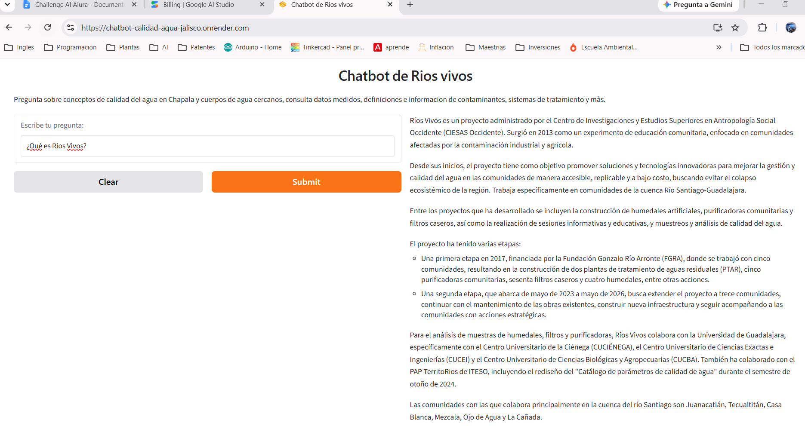
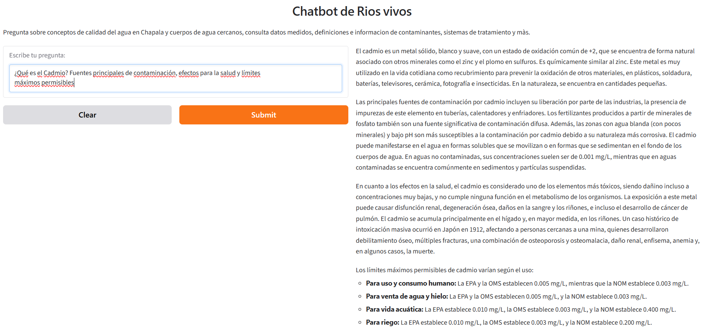
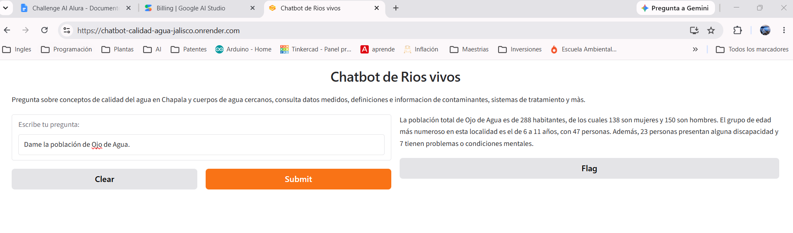
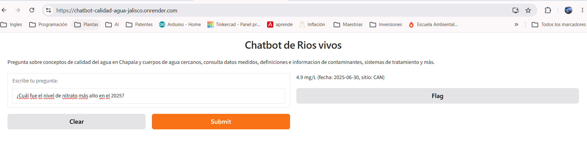
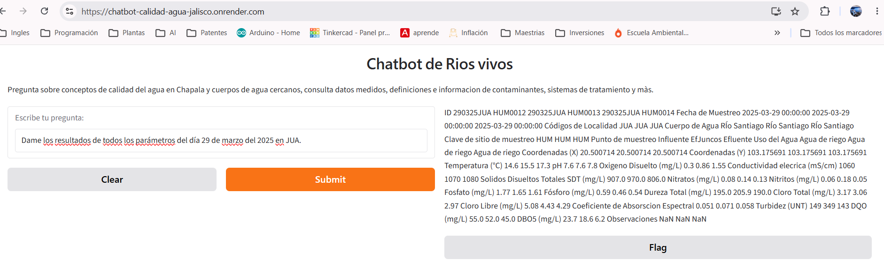

# Chatbot de Calidad del Agua — Ríos Vivos (Jalisco, México)

Agente conversacional construido con LangChain y Gemini que responde preguntas sobre la
problemática de contaminación del agua en Jalisco (cuenca Río Santiago–Guadalajara / Lago de
Chapala), combinando una herramienta de búsqueda documental (RAG) y una herramienta de
consulta de datos medidos de calidad del agua (pandas).

**Demo pública:** https://chatbot-calidad-agua-jalisco.onrender.com
*(el plan gratuito de Render duerme el servicio tras ~15 min de inactividad; la primera
pregunta después de un rato sin uso puede tardar hasta 50 segundos en responder mientras
el servicio despierta — no es un error, solo hay que esperar).*

**Repositorio:** https://github.com/eduardoalonso250201-maker/chatbot-calidad-agua-jalisco

### Capturas del deploy funcionando











*(Video de demostración: agrega aquí el link una vez que lo subas a GitHub o a donde prefieras
alojarlo.)*

---

## Descripción del proyecto

Este proyecto nace de una necesidad real de documentación de **Ríos Vivos**, una asociación
sin fines de lucro que trabaja con comunidades de la cuenca Río Santiago–Guadalajara
afectadas por la contaminación del agua en Jalisco, México.

La asociación cuenta con material extenso: definiciones de contaminantes, sus implicaciones
para la salud, límites máximos permisibles según normativas (NOM, OMS, EPA), información sobre
sistemas de tratamiento según el uso del agua, y contexto general sobre la organización y su
labor en las comunidades. Toda esta documentación, aunque valiosa, es densa y poco accesible
para pobladores locales o nuevos colaboradores que buscan una respuesta puntual sin tener que
leer documentos completos.

Adicionalmente, la asociación recopila resultados de monitoreos de parámetros de calidad del
agua (temperatura, pH, oxígeno disuelto, nitratos, DQO, cloro, entre otros) en distintas
localidades y fechas, almacenados en una tabla. Consultar esta tabla normalmente requiere saber
usar Excel o conocer su estructura interna (nombres de columnas, códigos de sitio, formato de
fechas). Este proyecto elimina esa barrera: cualquier persona puede preguntar en lenguaje
natural ("¿cuál fue el nivel de DQO más alto en Juanacatlán en 2025?") y recibir una respuesta
extraída directamente de los datos reales, sin necesidad de tocar la hoja de cálculo.

El resultado es un chatbot con dos capacidades complementarias:

- Responder preguntas **conceptuales/explicativas** a partir de la documentación oficial de la
  asociación, evitando que el usuario tenga que leer todo el material por su cuenta.
- Responder preguntas sobre **datos medidos** de calidad del agua, filtrando la tabla real de
  resultados y devolviendo valores exactos (no estimados ni inventados por un modelo de
  lenguaje).

Esta segunda capacidad, además, deja una base ya funcional (extracción de filtros + acceso
estructurado a los datos) sobre la cual en el futuro se podría construir una tercera
herramienta que analice esos datos filtrados contra los límites permisibles documentados en el
RAG, cruzando ambas fuentes de información.

---

## Arquitectura

El proyecto sigue un patrón de **agente ReAct** (Reasoning + Acting) con dos herramientas
(tools) independientes. El LLM orquestador recibe la pregunta del usuario, decide —según la
descripción de cada tool— cuál de las dos usar, esa tool ejecuta su propia lógica interna
(que puede incluir sus propias llamadas a un LLM) y devuelve una respuesta ya lista para
mostrarse al usuario.

### Archivos de configuración

| Archivo | Contenido |
|---|---|
| `.env` | Guarda las API keys reales (`GEMINI_API_KEY`, y opcionalmente las de LangSmith). **No se sube al repositorio** por seguridad; cada persona que quiera correr el proyecto debe crear el suyo (ver [Instrucciones de instalación](#instrucciones-de-instalación)). |
| `my_keys.py` | Carga el `.env` con `python-dotenv` y expone las API keys como variables de Python listas para importar en el resto del proyecto. |
| `my_models.py` | Define el nombre del modelo de Gemini usado en todo el proyecto, como una sola constante (`GEMINI_FLASH`), para no repetir el string del modelo en cada archivo. |
| `requirements.txt` | Lista de todas las librerías necesarias para correr el proyecto. |
| `documentos_pdf/` | Documentos fuente (`.txt` y/o `.pdf`) de los que la herramienta de RAG extrae información: definiciones de contaminantes, límites permisibles, sistemas de tratamiento, contexto de Ríos Vivos, etc. |
| `resultado.csv` | Tabla real de resultados de monitoreo de calidad del agua de Ríos Vivos (parámetros medidos por sitio y fecha), usada por la herramienta de análisis de datos. |

### Herramienta de RAG (`RAG.py` → clase `HerramientaRAG`)

Responde preguntas conceptuales/explicativas a partir de la documentación de la asociación.
Está implementada como una clase `BaseTool` de LangChain (mismo patrón que las demás tools del
proyecto): tiene un nombre, una descripción (que es lo que el agente ReAct usa para decidir
si debe invocarla) y un método `_run()` con la lógica real. Cuando se invoca, hace lo
siguiente:

1. Carga todos los documentos `.pdf` y `.txt` de `documentos_pdf/`.
2. Los divide en fragmentos (chunks) manejables con `RecursiveCharacterTextSplitter`.
3. Genera un embedding (vector numérico) de cada fragmento con el modelo de embeddings de
   Gemini, y los almacena en una vector store de **FAISS**.
4. La pregunta del usuario pasa primero por un modelo "reescritor" (rewriter), cuyo único
   trabajo es reformularla para que la búsqueda semántica sea más precisa.
5. Esa pregunta reescrita se vectoriza y se compara contra la vector store para encontrar los
   fragmentos de documento más parecidos semánticamente (no por palabras clave, sino por
   significado).
6. Los fragmentos encontrados se pasan como contexto a Gemini junto con la pregunta *original*
   (sin reescribir), dentro de un prompt que le exige responder **únicamente** con base en ese
   contexto, y decir explícitamente que no tiene la información si no aparece ahí — esto es lo
   que evita que el modelo invente datos que no están en la documentación oficial.

**Nota técnica:** el método estándar de LangChain para hacer este último paso
(`vector_store.as_retriever()`) usa internamente `embed_query()`, que en la versión actual de
`gemini-embedding-001` tiene un bug conocido (reportado en el repositorio de
`langchain-google-genai`) que provoca errores 500. Por eso la búsqueda se implementó de forma
manual con `embed_documents()` + `similarity_search_by_vector()`, que sí funcionan de forma
estable.

No hay caché ni almacenamiento persistente del vector store: cada pregunta reconstruye el
índice desde cero. Esto simplifica mucho el código (no hay que preocuparse por invalidar una
caché si los documentos cambian) a cambio de que cada respuesta tarde un poco más.

### Herramienta de análisis de datos (`parametros_calidad.py` → clase `HerramientaParametrosCalidad`)

Responde preguntas sobre datos medidos de calidad del agua, filtrando directamente la tabla
real con **pandas** — sin que ningún LLM invente o redondee los números. Sigue la misma
estructura de `BaseTool` que la herramienta de RAG, pero su lógica interna es distinta:

1. Carga y limpia `resultado.csv` (normaliza espacios en nombres de columnas y códigos de
   localidad, que traían inconsistencias en los datos originales).
2. Define un modelo de datos con **Pydantic** (`FiltroConsulta`) que describe exactamente qué
   información hace falta extraer de la pregunta del usuario: qué parámetro se pregunta (de
   una lista cerrada de columnas válidas), qué sitio o sitios (aceptando tanto el código
   interno de la base de datos como el nombre completo de la localidad, traducido en el propio
   código), un rango de fechas, y qué operación se pide (máximo, mínimo, promedio o listado
   completo).
3. Le pide a Gemini (mediante `JsonOutputParser`) que **extraiga** ese filtro estructurado a
   partir de la pregunta en lenguaje natural — este es el único paso donde interviene un LLM.
4. Con el filtro ya extraído, se usa pandas puro (sin LLM de por medio) para filtrar el
   DataFrame real y calcular el resultado exacto. Esto es lo que garantiza que un número como
   "42.3 mg/L" sea el dato real de la tabla, no una aproximación generada por el modelo.
5. Una función auxiliar añade automáticamente la unidad correspondiente (mg/L, mS/cm, UNT,
   etc.) extrayéndola del propio nombre de la columna.
6. Incluye validaciones para evitar errores: si el filtro de sitio/fecha no arroja resultados,
   o si se pregunta por un parámetro que no existe en la tabla, se devuelve un mensaje claro en
   vez de un error o una tabla vacía sin explicación.
7. Soporta preguntas que mencionan varios sitios a la vez (por ejemplo, comparar el máximo de
   DQO entre tres localidades), devolviendo un resultado por cada sitio en vez de un solo
   máximo global.

### Orquestador y puntos de entrada

- **`orquestador.py`** define la clase `AgenteOrquestador`: instancia las dos herramientas
  anteriores, las registra como `Tool` de LangChain (con su nombre, función y descripción), y
  arma el agente ReAct (`create_react_agent`) con un prompt que le indica el formato de
  razonamiento a seguir (Thought → Action → Action Input → Observation → Final Answer).
- **`main.py`** importa `AgenteOrquestador`, lo envuelve en un `AgentExecutor` (que es lo que
  realmente ejecuta el ciclo de razonamiento y las llamadas a las tools), y expone un loop de
  preguntas por terminal: el usuario escribe una pregunta, recibe la respuesta, y puede seguir
  preguntando hasta escribir `fin`.
- **`app.py`** es una alternativa a `main.py`: en vez de un loop de terminal, envuelve el mismo
  `AgentExecutor` en una interfaz web sencilla con **Gradio**. Es esta la que se despliega
  públicamente en Render.

### Flujo completo de una pregunta

```
Usuario
  → main.py / app.py (entrada de la pregunta)
    → AgentExecutor (ciclo ReAct)
      → LLM orquestador decide qué tool usar, según su descripción
        → HerramientaRAG            (preguntas conceptuales/documentales)
              o
        → HerramientaParametrosCalidad   (preguntas sobre datos medidos)
      → la tool elegida devuelve su respuesta directamente al usuario
        (return_direct=True en ambas: la respuesta ya viene lista y no se
        vuelve a reprocesar con otro LLM, evitando que se altere un dato
        exacto o una respuesta ya bien fundamentada)
```

### Limitaciones conocidas

- **Sin memoria de conversación**: cada pregunta se procesa de forma independiente. El chatbot
  no recuerda preguntas ni respuestas anteriores, así que preguntas que dependen de contexto
  previo (por ejemplo, "y de esos, ¿cuál es el más peligroso?") no van a funcionar — cada
  pregunta debe ser autocontenida.
- **Preguntas que piden agregar datos de muchas entidades a la vez** (por ejemplo, "dame la
  población de las 6 comunidades") pueden no cubrir el 100% de los casos: la búsqueda semántica
  del RAG recupera un número fijo de fragmentos (`k=7`) por pregunta, y en documentos con
  muchas entidades distintas eso puede no alcanzar para cubrirlas todas. Subir ese número
  mejora la cobertura pero incrementa el tiempo de respuesta — es un balance deliberado, no un
  error.
- **Primera respuesta lenta tras inactividad**: por el plan gratuito de Render, el servicio se
  duerme tras ~15 minutos sin uso y tarda hasta 50 segundos en la siguiente visita.

---

## Tecnologías utilizadas

| Tecnología | Uso en el proyecto |
|---|---|
| **Python** | Lenguaje principal del proyecto. |
| **LangChain** (`langchain`, `langchain-core`, `langchain-community`, `langchain-text-splitters`, `langchain_classic`) | Framework usado para construir las cadenas (chains), el splitter de texto, los parsers de salida, y el agente ReAct. |
| **Google Gemini** (`langchain-google-genai`) | Modelo de lenguaje (`gemini-2.5-flash`) usado por el agente orquestador y por ambas herramientas, y modelo de embeddings (`gemini-embedding-001`) usado para vectorizar los documentos en la herramienta de RAG. |
| **Agente ReAct** | Patrón de razonamiento (Reasoning + Acting) que usa el orquestador para decidir, en cada pregunta, cuál herramienta invocar y con qué input, antes de dar una respuesta final. |
| **RAG (Retrieval-Augmented Generation)** | Técnica usada en `HerramientaRAG`: en vez de que el modelo responda solo con lo que "sabe", primero se recupera información relevante de los documentos propios de la asociación y se obliga al modelo a basar su respuesta únicamente en ese contenido recuperado. |
| **FAISS** | Vector store donde se almacenan los embeddings de los fragmentos de documentos, usada para la búsqueda por similitud semántica. |
| **Pandas** | Librería usada en `HerramientaParametrosCalidad` para filtrar y calcular resultados reales sobre la tabla de calidad del agua, sin intervención de un LLM en ese paso. |
| **Pydantic** | Define la "forma" exacta que debe tener la respuesta estructurada que se le pide al LLM (tanto el filtro de la tabla de pandas como cualquier otro dato estructurado), validando que el LLM regrese el formato esperado. |
| **Gradio** | Framework usado para construir la interfaz web simple (`app.py`) con la que un usuario puede interactuar con el chatbot desde el navegador, sin usar la terminal. |
| **Render** | Plataforma donde está desplegada la aplicación (`app.py`), dándole al proyecto una URL pública accesible por cualquier persona. |
| **python-dotenv** | Carga las variables de entorno (API keys) desde el archivo `.env` local, para no exponer las llaves directamente en el código. |
| **LangSmith** *(opcional)* | Herramienta de observabilidad usada durante el desarrollo para inspeccionar, paso a paso, qué tool eligió el agente y qué input/output tuvo cada llamada — útil para depurar, no es necesaria para que el chatbot funcione. |

---

## Instrucciones de instalación

Estas instrucciones asumen que vas a correr el proyecto localmente en Visual Studio Code,
desde cero.

### 1. Requisitos previos

- **Python 3.12** instalado ([python.org](https://www.python.org/downloads/)). Verifica con:
  ```
  python --version
  ```
- **Git** instalado ([git-scm.com](https://git-scm.com/downloads)).
- **Visual Studio Code** instalado, con la extensión oficial de Python (Microsoft) activada.
- Una **API key de Gemini**, gratuita, obtenida en
  [Google AI Studio](https://aistudio.google.com/apikey).

### 2. Clonar el repositorio

```
git clone https://github.com/eduardoalonso250201-maker/chatbot-calidad-agua-jalisco.git
cd chatbot-calidad-agua-jalisco
```

Abre esa carpeta en VS Code (`code .` o desde "Abrir carpeta").

### 3. Crear y activar un entorno virtual

En la terminal integrada de VS Code (PowerShell, en Windows):

```
python -m venv .venv
```

Actívalo:

```
Set-ExecutionPolicy -Scope Process -ExecutionPolicy RemoteSigned
.venv\Scripts\Activate.ps1
```

*(En Mac/Linux sería `source .venv/bin/activate`.)*

Deberías ver `(.venv)` al inicio de la línea de la terminal, confirmando que está activo.
Asegúrate también de seleccionar ese entorno como intérprete de Python en VS Code (`Ctrl+Shift+P`
→ "Python: Select Interpreter" → elige el que dice `.venv`).

### 4. Instalar las dependencias

```
pip install -r requirements.txt
```

### 5. Configurar tu API key

Crea un archivo llamado `.env` en la raíz del proyecto (mismo nivel que `main.py`) con el
siguiente contenido:

```
GEMINI_API_KEY=tu_api_key_aqui
```

*(Opcional, solo si quieres observabilidad con LangSmith — no es necesario para que el chatbot
funcione):*

```
LANGSMITH_TRACING=true
LANGSMITH_API_KEY=tu_api_key_de_langsmith
LANGSMITH_PROJECT=chatbot-calidad-agua-jalisco
```

**Nunca subas este archivo a un repositorio público** — ya está incluido en `.gitignore` para
evitarlo por accidente.

### 6. Correr el proyecto

Opción A — loop interactivo por terminal:

```
python main.py
```

Escribe tu pregunta cuando se te pida, y repite hasta escribir `fin` para terminar.

Opción B — interfaz web local con Gradio:

```
python app.py
```

`app.py` está configurado con `server_name="0.0.0.0"` (necesario para que funcione en Render),
así que la terminal va a mostrar `Running on local URL: http://0.0.0.0:7860` — esa dirección
tal cual no es abrible en el navegador. En su lugar, abre manualmente:

```
http://localhost:7860
```

---

## Ejemplos de preguntas y respuestas

### Herramienta de RAG (documentación de Ríos Vivos)

**1. ¿Qué es Ríos Vivos?**

Ríos Vivos es un proyecto administrado por el Centro de Investigaciones y Estudios Superiores
en Antropología Social Occidente (CIESAS Occidente). Surgió en 2013 como un experimento de
educación comunitaria, enfocado en comunidades afectadas por la contaminación, principalmente
de origen industrial y agrícola.

Desde sus inicios, el proyecto tiene como objetivo promover soluciones y tecnologías
innovadoras para mejorar la gestión y la calidad del agua en las comunidades. Estas soluciones
buscan ser accesibles, replicables y de bajo costo, con el propósito fundamental de prevenir el
colapso ecosistémico de la región. Ríos Vivos trabaja específicamente en comunidades ubicadas
en la cuenca del Río Santiago-Guadalajara.

**2. ¿Cuáles son las alianzas de Ríos Vivos?**

Ríos Vivos cuenta con varias alianzas estratégicas para llevar a cabo sus proyectos. Colabora
con la Universidad de Guadalajara, específicamente a través de tres de sus centros
universitarios: el Centro Universitario de la Ciénega (CUCIÉNEGA), el Centro Universitario de
Ciencias Exactas e Ingenierías (CUCEI) y el Centro Universitario de Ciencias Biológicas y
Agropecuarias (CUCBA). Esta colaboración se enfoca en el análisis de muestras de humedales,
filtros y purificadoras.

Otro aliado fundamental es la organización comunitaria Un Salto de Vida, cuyos miembros han
tenido una participación activa tanto en la concepción como en el desarrollo del trabajo de
Ríos Vivos.

Además, el Instituto Tecnológico y de Estudios Superiores de Occidente (ITESO) colabora con
Ríos Vivos mediante el Proyecto de Aplicación Profesional (PAP) "TerritoRios: Saberes por la
recuperación ecológica". Este PAP brinda apoyo específico a las comunidades de Juanacatlán, La
Cañada, Casa Blanca, Mezcala, Ojo de Agua y Tecualtitán. Durante el semestre de otoño de 2024,
el PAP TerritoRios acompañó a las comunidades de Juanacatlán, Casa Blanca, Ojo de Agua y La
Cañada, realizando cinco visitas de campo para el diseño de alternativas socio-tecnológicas.
Los entregables de esta colaboración incluyeron dos instructivos sobre pruebas microbiológicas
y el uso de plumas multiparámetro para análisis de calidad de agua, una maqueta demostrativa
del funcionamiento de un humedal de tratamiento, el rediseño del "Catálogo de parámetros de
calidad de agua" para mejorar su accesibilidad, y un manual audiovisual sobre cómo obtener la
Demanda Bioquímica de Oxígeno (DBO) en laboratorio.

**3. Dime en qué comunidades ha tenido actividad Ríos Vivos.**

Ríos Vivos colabora principalmente con las comunidades de Juanacatlán, Tecualtitán, Casa
Blanca, Mezcala, Ojo de Agua y La Cañada, todas ellas ubicadas en la cuenca del río Santiago.

Específicamente, el Proyecto de Aplicación Profesional (PAP) "TerritoRios: Saberes por la
recuperación ecológica" del ITESO, que colabora con Ríos Vivos, apoya a las comunidades de
Juanacatlán, La Cañada, Casa Blanca, Mezcala, Ojo de Agua y Tecualtitán. Durante el semestre de
otoño de 2024, este PAP acompañó a las comunidades de Juanacatlán, Casa Blanca, Ojo de Agua y
La Cañada.

En su primera etapa (2017), Ríos Vivos trabajó con cinco comunidades distintas, y en su segunda
etapa (mayo 2023 - mayo 2026) busca extender el proyecto a trece comunidades, aunque no se
especifican los nombres de todas ellas para cada etapa.

**4. Dame la población de Ojo de Agua.**

La población total de Ojo de Agua es de 288 habitantes, de los cuales 138 son mujeres y 150 son
hombres. El grupo de edad más numeroso en esta comunidad es el de 6 a 11 años, con 47 personas.
Además, 23 personas presentan alguna discapacidad y 7 tienen problemas o condiciones mentales.

**5. Menciona la población de todas las comunidades sobre las que actúa Ríos Vivos.**

*(Este ejemplo se corrió subiendo temporalmente `k=15` en `HerramientaRAG` para que la búsqueda
tomara más fragmentos — con el `k=7` que se dejó por defecto, es esperable que cubra menos
comunidades. Ver [Limitaciones conocidas](#limitaciones-conocidas).)*

Ríos Vivos colabora principalmente con las comunidades de Juanacatlán, Tecualtitán, Casa
Blanca, Mezcala, Ojo de Agua y La Cañada.

De estas comunidades, la información proporcionada detalla la población de Juanacatlán, que
cuenta con un total de 9,626 habitantes, de los cuales 4,835 son mujeres y 4,791 son hombres.
El grupo de edad más numeroso en Juanacatlán es el de 18 a 24 años, con 1,216 personas. Además,
en Juanacatlán, 10 personas de 3 años o más hablan alguna lengua indígena y 27 residen en
hogares censales indígenas. También se registra que 480 personas presentan alguna discapacidad
y 86 tienen problemas o condiciones mentales.

Para las comunidades de Tecualtitán, Casa Blanca, Mezcala, Ojo de Agua y La Cañada, el
contenido proporcionado no incluye datos específicos sobre su población.

**6. Menciona estudios que se hayan hecho respecto a la contaminación del Río Santiago.**

Se han realizado varios estudios e investigaciones respecto a la contaminación del Río
Santiago.

En 2020, Patricia Martínez, quien era la coordinadora general de Gestión Integral del
Territorio en ese momento, llevó a cabo una investigación que incluyó la localización de 500
puntos de descarga y el análisis de muestras de agua de 150 de ellos. Como resultado, se
identificó una lista de 29 empresas cuyas descargas contenían contaminantes por encima de los
límites normativos, destacando entre ellas a Nestlé, Hershey's, Honda y Urrea Herramientas.

Además, en 2009, la doctora Gabriela Domínguez Cortinas, de la Universidad Autónoma de San Luis
Potosí, realizó un estudio por encargo de la Comisión Estatal del Agua de Jalisco. Este estudio
se centró en los impactos a la salud causados por la contaminación del río Santiago en las
poblaciones de Juanacatlán, El Salto, Tonalá, La Cofradía y Jardines de la Barranca, con un
enfoque particular en la salud infantil. Entre sus hallazgos principales se encontraron
alteraciones hematológicas en un alto porcentaje de niños (88.5% en La Cofradía, 79% en El
Salto, 64% en Juanacatlán), presencia de plomo en sangre (93.8% en Juanacatlán, cerca del 50%
en El Salto y La Cofradía), y niveles elevados de creatinina (73.7% en Juanacatlán, 59.2% en La
Cofradía, 61.9% en El Salto). También se detectó benceno, una sustancia cancerígena asociada a
la leucemia, y una disminución en el tamaño de los glóbulos rojos. El estudio concluyó que más
del 40% de los niños en estas comunidades padecían enfermedades graves y presentaban un declive
notable en sus capacidades cognitivas y rendimiento académico, atribuido a los efectos
neuronales negativos de las toxinas. Cabe destacar que este estudio fue mantenido oculto por
las autoridades políticas durante aproximadamente diez años antes de ser divulgado
públicamente.

También se menciona que el río Santiago es considerado uno de los cuerpos de agua más
contaminados del país, con más de 1,000 sustancias contaminantes identificadas en sus aguas,
incluyendo metales pesados y compuestos sintéticos de alta volatilidad. Esta información se
atribuye a investigaciones de Galindo (2021) y Piña (2023), quienes señalan que alrededor de
750 instalaciones industriales operan en la zona, de las cuales al menos 250 descargan
directamente sus desechos tóxicos en el río. La normatividad ambiental mexicana solo regula
aproximadamente 20 de estos contaminantes, lo que resalta una brecha significativa identificada
en la investigación.

Finalmente, el proyecto "Ríos Vivos", administrado por el Centro de Investigaciones y Estudios
Superiores en Antropología Social Occidente (CIESAS Occidente) desde 2013, trabaja en las
comunidades de la cuenca Río Santiago-Guadalajara. Aunque no es un estudio puntual, es un
proyecto de educación comunitaria que busca promover soluciones y tecnologías innovadoras para
mejorar la gestión y calidad del agua en comunidades afectadas por la contaminación industrial
y agrícola, lo que implica una investigación y acción continua sobre la problemática.

**7. Menciona alternativas de tratamiento que haya probado Ríos Vivos.**

Ríos Vivos ha probado diversas alternativas de tratamiento en las comunidades con las que
colabora. Entre los proyectos que ha desarrollado se incluyen humedales artificiales,
purificadoras comunitarias y filtros caseros.

Durante su primera etapa, con el financiamiento de la Fundación Gonzalo Río Arronte, se
construyeron dos plantas de tratamiento de aguas residuales (PTAR), cinco purificadoras
comunitarias, sesenta filtros caseros y cuatro humedales, además de otras acciones. Estos
humedales construidos son considerados una alternativa viable para el tratamiento de aguas
municipales y efluentes industriales, como los de la industria tequilera y agroindustrial en
Jalisco, ayudando a reducir la carga de contaminantes en cuerpos de agua como el Lago de
Chapala y el Río Santiago.

**8. ¿Qué es un humedal?**

Los humedales son zonas de transición que se encuentran entre los sistemas acuáticos y
terrestres. Estas áreas están inundadas de forma temporal o permanente.

**9. Componentes principales de un humedal.**

Los humedales son zonas de transición entre sistemas acuáticos y terrestres que se encuentran
inundadas de forma temporal o permanente. Sus componentes principales, que les permiten cumplir
sus funciones, incluyen:

- **Agua:** son espacios que se encuentran inundados, recibiendo agua residual en el caso de
  los humedales construidos, y donde el agua puede fluir de forma visible sobre la superficie o
  por debajo de un medio filtrante.
- **Suelo o medio filtrante:** funcionan como un filtro natural que atrapa partículas y
  sedimentos. Algunos tipos, como los humedales de lecho de arena, cuentan con una capa de
  arena donde se infiltra el agua residual para su tratamiento.
- **Plantas:** poseen una flora diversa. Las plantas presentes absorben distintos
  contaminantes, utilizándolos como nutrientes para su desarrollo, principalmente nitrógeno y
  fósforo.
- **Microorganismos:** un consorcio de microorganismos descompone la materia orgánica presente
  en el agua residual, transformándola en nutrientes y gases que son liberados al ambiente.
- **Aire/Oxígeno:** la aireación natural que ocurre en estos espacios aumenta los niveles de
  oxígeno disuelto en el agua, lo cual favorece la descomposición microbiana.

**10. ¿Qué son las microcistinas?**

Las microcistinas son hepatotoxinas producidas por una gran variedad de cianobacterias,
incluyendo especies como *Microcystis sp.* Estas toxinas se originan a partir de floraciones de
cianobacterias, que son microorganismos fotosintéticos.

Se consideran uno de los contaminantes más tóxicos presentes en el agua. La exposición a las
microcistinas puede provocar efectos agudos, como ronchas, comezón y malestar, así como efectos
crónicos, incluyendo cáncer, daño renal y daño hepático. Son particularmente tóxicas para la
población infantil. Además, debido a su capacidad de bioacumulación y biomagnificación, pueden
generar efectos crónicos como daño genotóxico, mutagénico y teratogénico.

La variedad LR es la más común y tóxica de las microcistinas, y la información sobre su
toxicidad es la más estudiada. Debido a su alta toxicidad, la Organización Mundial de la Salud
(OMS) ha establecido límites provisionales y recomendados:

- Un límite provisional de 1 µg/L de microcistina-LR para agua potable.
- Un consumo máximo de 0.04 µg/kg de peso corporal.
- Un límite recomendado de 2-4 µg/L de MC-LR para mantener un riesgo bajo de posibles efectos
  en la salud en aguas de uso recreativo.

La OMS también relaciona la cantidad de microcistinas estimadas con la concentración de
cianobacterias o clorofila para establecer niveles de riesgo:

- Riesgo Bajo: nivel estimado de microcistina < 10 µg/L.
- Riesgo Moderado: nivel estimado de microcistina 10–20 µg/L.
- Riesgo Alto: nivel estimado de microcistina 20–2,000 µg/L.
- Riesgo Muy Alto: nivel estimado de microcistina >2,000 µg/L.

**11. ¿Qué es el Cadmio? Fuentes principales de contaminación, efectos para la salud y límites
máximos permisibles.**

El cadmio es un metal que se utiliza ampliamente como recubrimiento en otros materiales para
prevenir la oxidación, así como en plásticos, soldaduras, baterías, televisores, cerámica,
fotografía e insecticidas, siendo un elemento común en la vida diaria. Se encuentra en la
naturaleza asociado con otros minerales, aunque en pequeñas cantidades. Técnicamente, es un
metal con un estado de oxidación común de +2, químicamente similar al zinc, y se halla de forma
natural con el zinc y el plomo en minerales de sulfuro. Su forma es sólida, blanca y suave. En
aguas no contaminadas, sus concentraciones suelen ser de 0.001 mg/L.

Las principales fuentes de contaminación de cadmio incluyen su liberación por parte de las
industrias, así como impurezas del elemento en tuberías, calentadores y enfriadores. Los
lugares con agua blanda (con pocos minerales) y bajo pH son más susceptibles a la contaminación
por cadmio debido a su naturaleza corrosiva. Los fertilizantes producidos a partir de minerales
de fosfato también constituyen una fuente importante de contaminación difusa.

En cuanto a los efectos en la salud, el cadmio es uno de los elementos más tóxicos, siendo
dañino incluso a concentraciones muy bajas. La exposición a este metal puede causar disfunción
renal, degeneración de los huesos, daños en la sangre y los riñones, e incluso el desarrollo de
cáncer de pulmón. Se acumula principalmente en el hígado y, en mayor medida, en los riñones.

Los límites máximos permisibles de cadmio varían según el uso y la entidad reguladora:

- **Para uso y consumo humano:** la EPA y la OMS establecen 0.005 mg/L, mientras que la NOM
  establece 0.003 mg/L.
- **Para venta de agua y hielo:** la EPA y la OMS establecen 0.005 mg/L, y la NOM establece
  0.003 mg/L.
- **Para vida acuática:** la EPA establece 0.010 mg/L, la OMS establece 0.003 mg/L, y la NOM
  establece 0.400 mg/L.
- **Para riego:** la EPA establece 0.010 mg/L, la OMS establece 0.003 mg/L, y la NOM establece
  0.200 mg/L.

### Herramienta de análisis de datos (`parametros_calidad.py`)

**1. ¿Cuál fue el nivel de nitrato más alto en el 2025?**

```
4.9 mg/L (fecha: 2025-06-30, sitio: CAN)
```

**2. Dame los resultados de todos los parámetros del día 29 de marzo del 2025 en JUA.**

```
ID                                      290325JUA HUM0012    290325JUA HUM0013    290325JUA HUM0014
Fecha de Muestreo                     2025-03-29 00:00:00  2025-03-29 00:00:00  2025-03-29 00:00:00
Códigos de Localidad                                  JUA                  JUA                  JUA
Cuerpo de Agua                               RÍo Santiago         RÍo Santiago         RÍo Santiago
Clave de sitio de muestreo                            HUM                  HUM                  HUM
Punto de muestreo                               Influente             EfJuncos             Efluente
Uso del Agua                                Agua de riego        Agua de riego        Agua de riego
Coordenadas (X)                                 20.500714            20.500714            20.500714
Coordenadas (Y)                                103.175691           103.175691           103.175691
Temperatura (°C)                                     14.6                 15.5                 17.3
pH                                                    7.6                  7.6                  7.8
Oxigeno Disuelto (mg/L)                               0.3                 0.86                 1.55
Conductividad elecrica (mS/cm)                       1060                 1070                 1080
Solidos Disueltos Totales SDT (mg/L)                907.0                970.0                806.0
Nitratos (mg/L)                                      0.08                 0.14                 0.13
Nitritos (mg/L)                                      0.06                 0.18                 0.05
Fosfato (mg/L)                                       1.77                 1.65                 1.61
Fósforo (mg/L)                                       0.59                 0.46                 0.54
Dureza Total (mg/L)                                 195.0                205.9                190.0
Cloro Total (mg/L)                                   3.17                 3.06                 2.97
Cloro Libre (mg/L)                                   5.08                 4.43                 4.29
Coeficiente de Absorscion Espectral                 0.051                0.071                0.058
Turbidez (UNT)                                        149                  349                  143
DQO (mg/L)                                           55.0                 52.0                 45.0
DBO5 (mg/L)                                          23.7                 18.6                  6.2
Observaciones                                         NaN                  NaN                  NaN
```

**3. ¿Cuál fue el promedio de DQO en Juanacatlán?**

```
99.93255150000002 mg/L
```

**4. ¿Cuál fue la fecha del valor más alto de DQO en Juanacatlán?**

```
JUA: 330.0 mg/L (fecha: 2025-06-30)
```

**5. ¿Cuál fue el nivel de arsénico en JUA?**

*(El arsénico no es un parámetro medido en la tabla — la herramienta no debe fallar, solo
avisar que no está disponible.)*

```
El parametro 'NO_DISPONIBLE' no esta en la tabla. Los parametros disponibles son: Temperatura (°C),
pH, Oxigeno Disuelto (mg/L), Conductividad elecrica (mS/cm), Solidos Disueltos Totales SDT (mg/L),
Nitratos (mg/L), Nitritos (mg/L), Fosfato (mg/L), Fósforo (mg/L), Dureza Total (mg/L),
Cloro Total (mg/L), Cloro Libre (mg/L), Coeficiente de Absorscion Espectral, Turbidez (UNT),
DQO (mg/L), DBO5 (mg/L)
```

